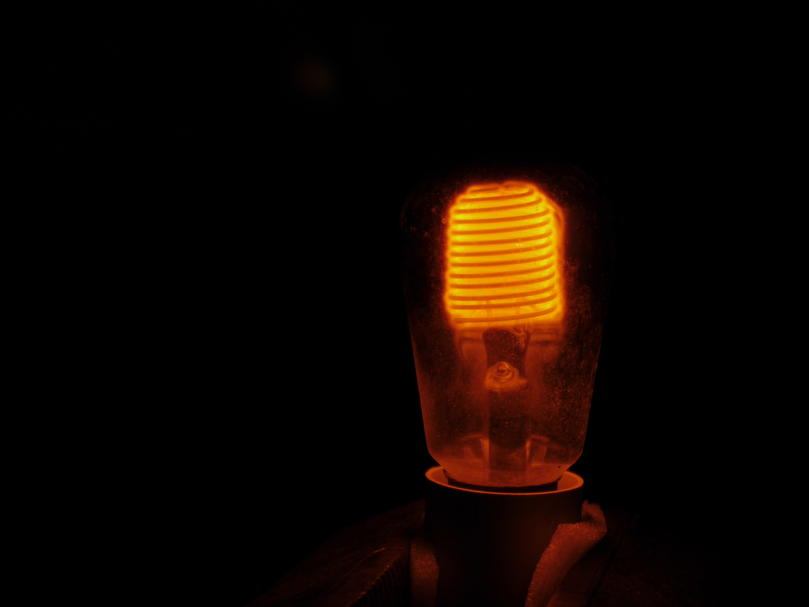

Hab in diesem alten Haus paar alte Glühbirnen gefunden.  

# Zwirbel Wirbel

Wie eine von diesen fancy neuen LED Birnen mit coolem zwirbel LED Filament.  
Nur, dass es weder LED noch neu ist.  
Braucht grob 170W. Ziemlich hell!

Mama schau mal, keine LEDs!

Frag mich, ob die wer per Hand gedreht hat oder so. 

# Komischer Hummel-Hintern

Keine Ahnung, was das ist. Leuchtet sehr schwach und braucht ca. 4W.  
Sind eigentlich 2 Filamente(?), wo jedes nur auf einer Hälfte der Sinuswelle an ist.  
Die Verspiegelung ist glaub ich keine Absicht und mehr Abdampfen vom Filament oder so.  
Seltsames Ding.

# Heißer Scheiß

Was für eine abartige Birne. Kein Glas und nix. Und super langes Filament?

Ah, nein. Es ist nur eine 800W Heizung, bei der man direkt den Heizdraht abschlecken kann. 

# Umweltfreundlicher Klotz

Soweit ich das beurteilen kann, ist dieses schwere Ding einfach ein Trafo, damit man winzige schwache Birnen reinstecken und Strom sparen kann.  
Nicht besonders hell, solange abgedreht. 

Auch nicht viel heller aufgedreht. 

# Fotografenbirne

Dicke Birne.

Sehr *sehr* hell, für eine Glühbirne. Kamera übersteuert, egal was ich mach. 

Stellt sich raus, die ist für Fotografie.  
Kein Blitzlicht - man steckt die ganz normal am Netzstrom an - aber sie *ist* explizit fürs Fotos Machen. 

Kein Wunder, dass sie hell ist. Braucht 500W.  

Ich hab bisschen rumgegooglet, und anscheinend gibt's die noch auf ebay&co. Also nicht super rar.  
Jemand in einem Forum meinte, die haben eine durchschnittliche Lebenserwartung von **7 Stunden**. Jessas. 
