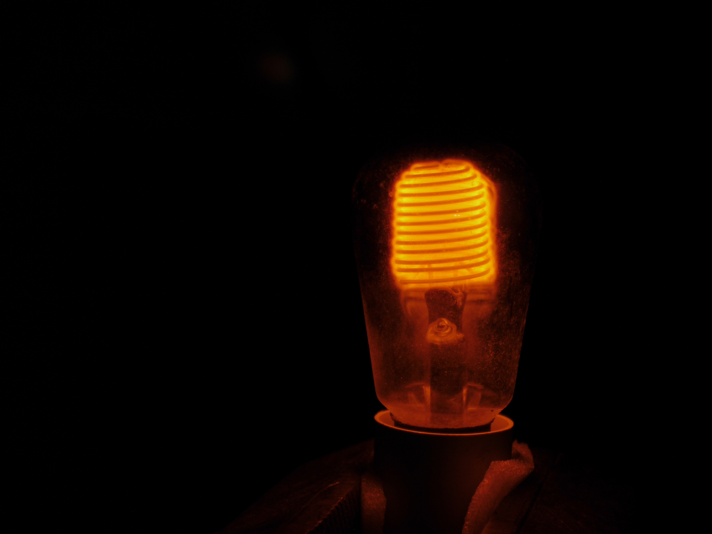

古い家を掃除したら古い電球が出てきた。  

# ぐるぐる

イケアとかでよく見かける新型おしゃれぐるぐるLED電球。  
ただLEDでも新しくもなくて大昔の本物だ。  
消費電力は170Wぐらい。けっこう明るい！

LEDなし！

手作りなんだろうか。

# 蜂のお尻

何なんだろうね。4Wぐらいしか使わなくて薄暗い。
フィラメントが2つ入っていて、それぞれ半波しか点灯しない。
ガラスがちょっと鏡になっているのは多分特徴じゃなくて、スパッタリングだと思う。  
ふーん。

# 熱いやつ

おかしな電球だな。ガラスがないしフィラメントもなんか長い。

あ、いや。全然電球とかじゃなくて800Wの電熱線に直接ふれあい体験ができるヒータだ。

# 環境にやさしいやつ

多分だけど、これはちっちゃい電球をコンセント電圧で使えるようにするトランスだと思う。  
消灯のときは光らない。

点けてもそんなに光らない。

# 撮影のやつ

でっかい電球。

白熱電球にしては*すんごい*明るい。どうやっても露出オーバーになっちゃう。

箱を見たら写真撮影用だった。  
フラッシュじゃなくて、普通にコンセントに差し込む電球だけど、写真のためのものだ。

500Wだった。だからこんなに明るいんだね。  

ちょいググってみたら、まだebayとかで売ってるみたいだからそんなに珍しいものでもないみたいだ。  
どこかのフォーラムの人によると平均寿命は**7時間**ぐらいだそうだ。
