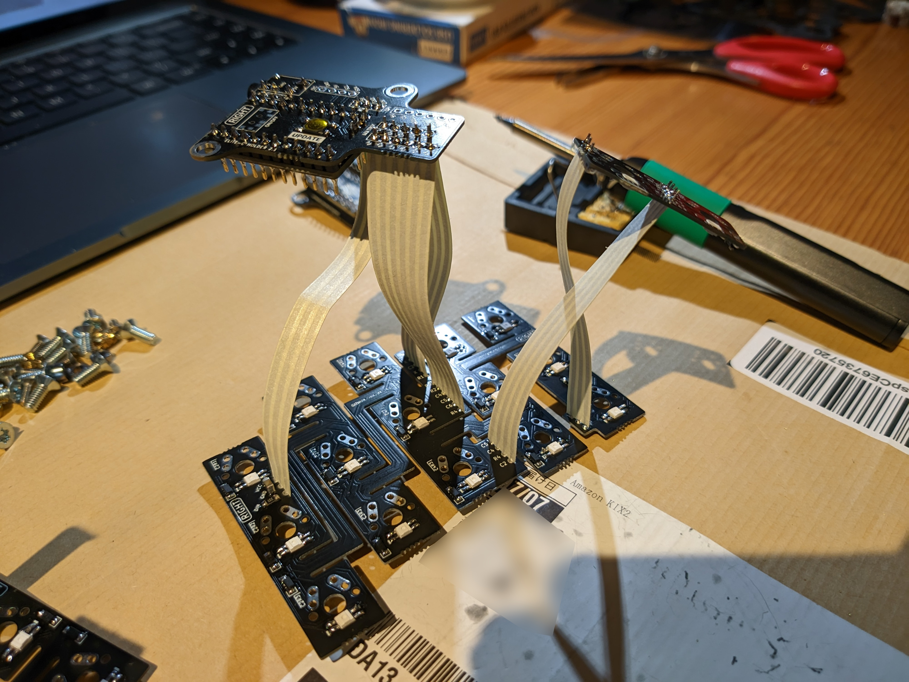
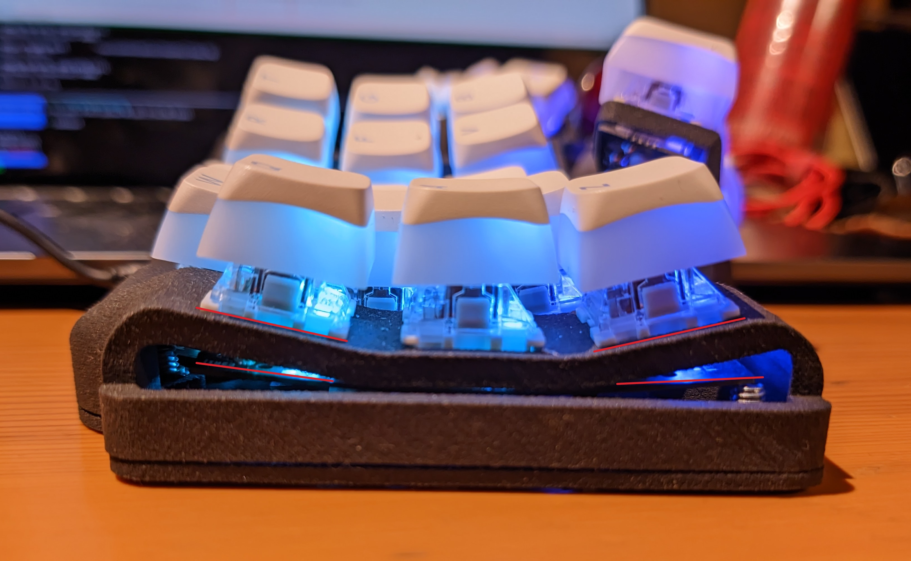
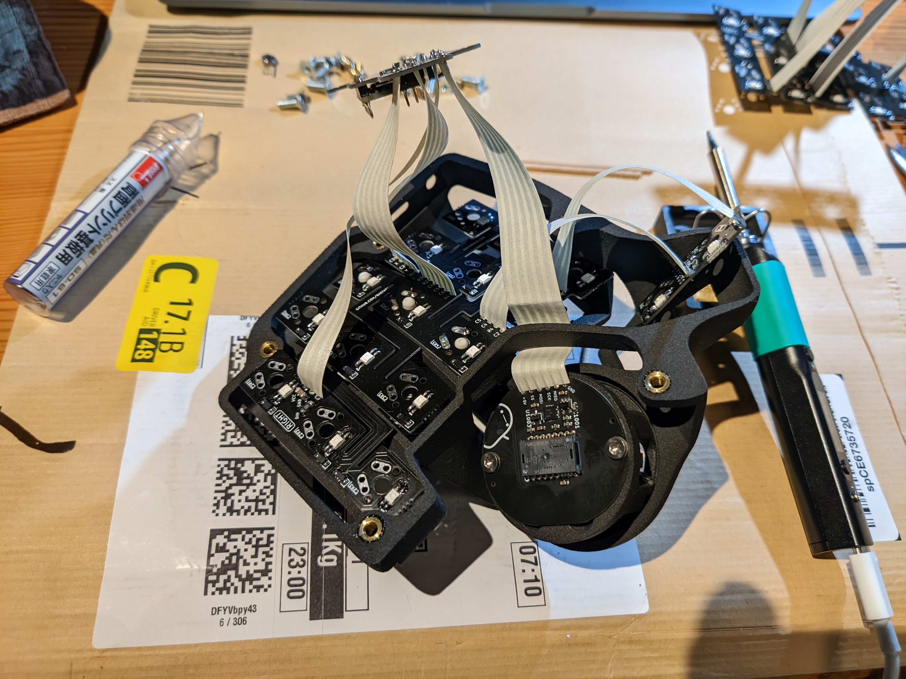
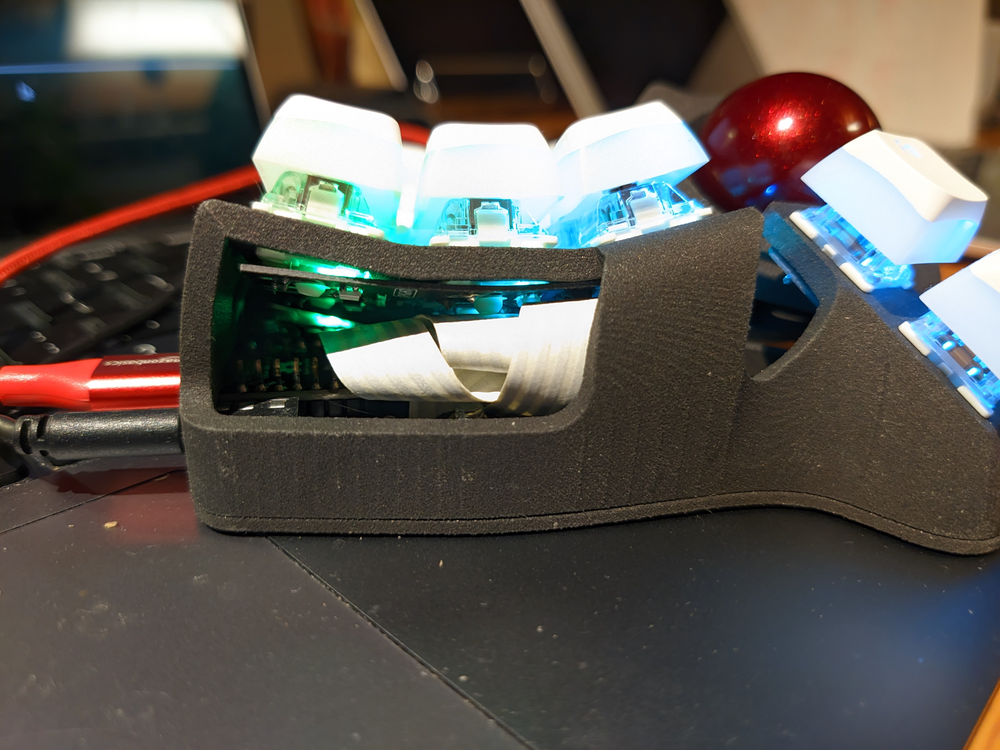
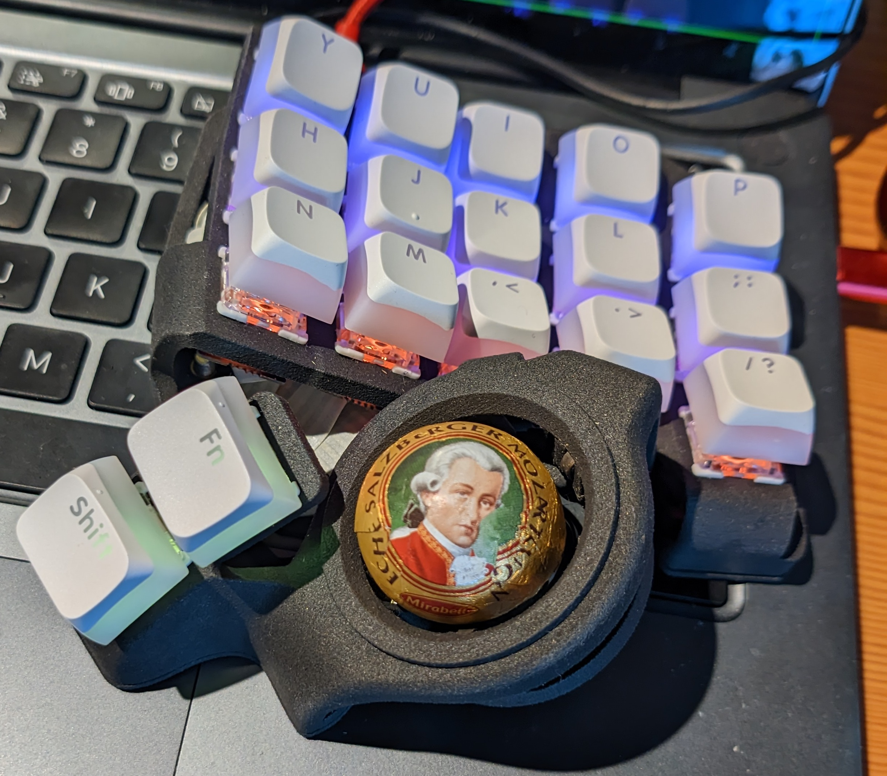

「カリブディス」？  
「チャリブヂス」？  
「ケライブディス」？  
　…  
「[カリュブディス](https://ja.wikipedia.org/wiki/%E3%82%AB%E3%83%AA%E3%83%A5%E3%83%96%E3%83%87%E3%82%A3%E3%82%B9)」だった

# 部品
- [Charybdis Nano Kit](https://bastardkb.com/product/charybdis-nano-kit/), RGBとトラックボール付き、ケースなし
- [JLCPCB](https://jlcpcb.com/)の3201PA-F Nylon (SLS)っていう材料で印刷してもらったケース。そのためのSTLファイルはGitHubの[ここ](https://github.com/Bastardkb/Charybdis/tree/main/files/3x5%20nano)と[ここ](https://github.com/Bastardkb/Skeletyl/tree/main/V4)から
- [Gateronのキースイッチ](https://www.gateron.co/products/gateron-g-pro-2-0-switch-set?_pos=3&_sid=c316e5d73&_ss=r)1本
- やすっぽい[XDAプロファイルの「プリン」キーキャップ](https://www.amazon.co.jp/gp/product/B0BN5P62ML/ref=ppx_yo_dt_b_asin_title_o00_s00?ie=UTF8&th=1)

# 組み立て
はんだ付け的にはほとんど大したことないけど、キットのリボンケーブルがかなり硬いから見た目異性植物になってちょっと曲技的な付け方が必要になったりはする。

([ハンズフリーツール](https://duckduckgo.com/?q=%E3%81%AF%E3%82%93%E3%81%A0%E4%BB%98%E3%81%91%E3%80%80%E3%83%8F%E3%83%B3%E3%82%BA%E3%83%95%E3%83%AA%E3%83%BC%E3%83%84%E3%83%BC%E3%83%AB&t=ffab&iar=images&iax=images&ia=images)の使用がおすすめ。

## 難しいところ１：スイッチのはんだ付け
スイッチは基板をケースの内側に押し付けて曲げながら付けなければいけない。  
基板はそのために平均より薄いもので確かに無事に曲がるけど、結局フレックス基板とか特別なものじゃなくてただの[FR4](https://ja.wikipedia.org/wiki/FR4)だからかなりの力を加える必要があって折れちゃいそうな感覚もする。折れないけど。  
あとは僕の場合はその固さのせいでケースと基板の間に数ミリの隙間ができた。  

光が漏れるのは残念だけどキーボードの操作の問題にはならない。


## 難しいところ２：ケーブル
ケーブルが幅広くて割と固いものでケースが狭いせいで、折ったりマイコンの足とかで怪我したりせずに全部入れるのはちょっとだけ面倒なことだ。  
僕のはそうはならなかったけどケーブルが何かに接触しただけでゴーストキーが出まくりになったから足を全部切るのもとても大事みたいだ。



# QMK
ファームウェアは定番の[QMK](https://qmk.fm/)。 
僕のキーマップは[こちら](https://github.com/Rouji/Charybdis-QMK).  
こんなキーの少ないキーボードの使い方とかはまだよくわからないし極めて個人的なものなのでマップそのもののコピペはおすすめできないけど、それ以外は参考になるかもしれない。

## 自動マウスレイヤー
Using an [auto_mouse_layer](https://github.com/qmk/qmk_firmware/blob/master/docs/feature_pointing_device.md#automatic-mouse-layer-idpointing-device-auto-mouse) (a layer that automatically activates, when you move the trackball) is very convenient, but slightly troublesome on the Charybdis.  
The optical sensor is very *very* **very** precise and sensitive. It will pick up tiny vibrations caused by even light typing and activate the mouse layer *constantly*.  

This can be fixed by thresholding the activation of that layer:  
```C
static const uint16_t AUTO_MOUSE_THRESHOLD = 200;
static uint16_t auto_mouse_cum = 0;

#define ABS(n) ((n) < 0 ? -(n) : (n))
bool auto_mouse_activation(report_mouse_t mouse_report)
{
    auto_mouse_cum += ABS(mouse_report.x) + ABS(mouse_report.y) + ABS(mouse_report.h) + ABS(mouse_report.v);
    if (auto_mouse_cum > AUTO_MOUSE_THRESHOLD)
    {
        auto_mouse_cum = 0;
        return true;
    }
    return false;
}
```
Mouse movement itself is not influenced by this. Just the layer activation. 

## Scrolling with the Trackball ("Drag Scroll")
A trackball makes an excellent scrolling device. Think touchpad two-finger scrolling, but more accurate, lower latency and more satisfying.  

This can be done completely firmware-side in QMK, as documented in the [QMK docs](https://github.com/qmk/qmk_firmware/blob/master/docs/feature_pointing_device.md#drag-scroll-or-mouse-scroll). 
It will work on any PC with any OS, just like a normal mouse.  
It does however behave like a scroll wheel, i.e. send very discrete "scroll a line" events, like the ticks of a scroll wheel do. But since the ball doesn't have discrete steps, this feels very awkward. High-res scrolling is [an open issue](https://github.com/qmk/qmk_firmware/issues/17585). 

For linux users, libinput can be used to work around that, using its [on-button scrolling feature](https://wayland.freedesktop.org/libinput/doc/latest/scrolling.html#button-scrolling). This *does* do high-res scrolling, and thus feels *a lot* better. 
It does however mean you need to configure this on all the PCs you use.  
I personally have KC_MS_BTN4 (the 4th mouse button, aka "the back button") in my keymap, and tell libinput to use that as my scroll button.  

Sway exposes this libinput feature and I have it configured like this:  
```
input "43256:6194:Bastard_Keyboards_Charybdis_Nano_(3x5)_Splinky_Mouse" {
    natural_scroll enabled
    scroll_button 275
    scroll_method on_button_down
    scroll_factor 0.3
}
```
To figure out what ID a button has, use `libinput debug-events`

## Compiling/Flashing
After double-pressing the reset button, the splinky presents itself as a USB storage device, which you're supposed to copy your .uf2 firmware file to.  
Slightly convoluted way of doing things, but it's nice for compatibility/cross-platformness, since no special software is needed for flashing. Annoying to automate though.  
I do something like this:
```bash
cd $HOME/qmk_firmware
./util/docker_build.sh bastardkb/charybdis/3x5/v2/splinky_3:rj || exit 1
while ! grep -q -s "/run/media/$USER/RPI-RP2" /proc/mounts; do
    sleep 1;
done
echo flashing
cp ./bastardkb_charybdis_3x5_v2_splinky_3_rj.uf2 /run/media/$USER/RPI-RP2
```
The splinky auto-resets after it's done flashing.

# Mozart Didn't Fit
[Mozartkugeln](https://en.wikipedia.org/wiki/Mozartkugel) apparently are 30mm in diameter, not 34. 

Sad.
