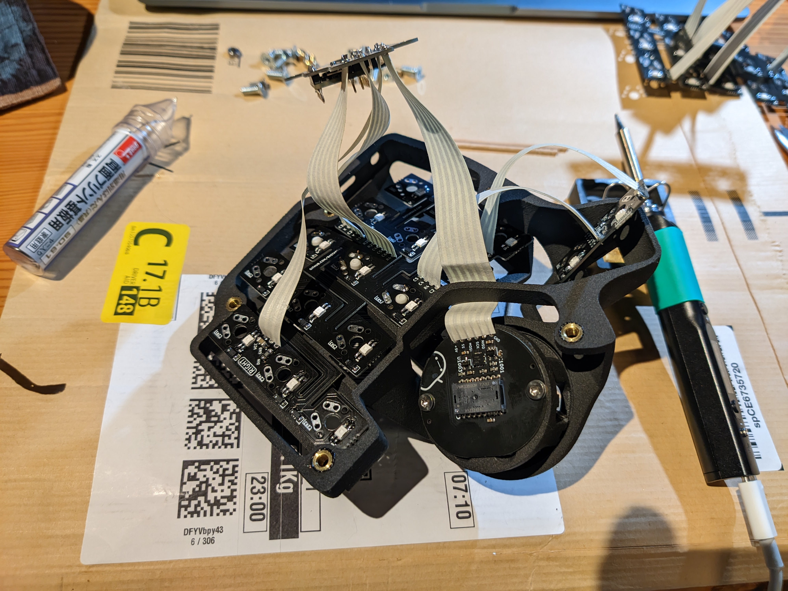

# Parts
- [Charybdis Nano Kit](https://bastardkb.com/product/charybdis-nano-kit/), with RGB and Trackball, without case
- The case printed by [JLCPCB](https://jlcpcb.com/) with 3201PA-F Nylon (SLS). STLs available [on github](https://github.com/Bastardkb/Charybdis/tree/main/files/3x5%20nano) and [on github](https://github.com/Bastardkb/Skeletyl/tree/main/V4)
- A tube of [Gaterons](https://www.gateron.co/products/gateron-g-pro-2-0-switch-set?_pos=3&_sid=c316e5d73&_ss=r)
- Cheapo [XDA "Pudding" Keycaps](https://www.amazon.co.jp/gp/product/B0BN5P62ML/ref=ppx_yo_dt_b_asin_title_o00_s00?ie=UTF8&th=1)

# Building the Thing
For the most part not too difficult. The ribbon cables provided in the kit are somewhat stiff, so you'll end up with some acrobatic floaty soldering in mid-air and alien tree-looking things along the way.  

... unless you have a few helping hands. ([the tool](https://duckduckgo.com/?t=ffab&q=soldering+helping+hands&iax=images&ia=images), or human I guess)  

# Tricky bit #1: Soldering the Switches
The PCBs need to be bent and held into place while soldering the Switches.  
The PCBs are thinner than usual for this purpose.  
They are however not actual flex PCBs or whatever, and kind of feel like they're gonna snap.  
Mine did not, but the PCBs just would not bend into place, or stay in place after soldering the switches.  

The middle row is basically spot-on everywhere, but the top and bottom rows just would not go into place and left a wedge-shaped gap between the switch and PCB.  
Functionality of the switches and RGB are basically not affected, but something is definitely off there. 


# Tricky bit #2: Cables
The Cables are big and stiff and the space very limited. Getting them routed to where they need to go, and ultimately all stuffed in without breaking/puncturing them anywhere is a chore.  
I did actually get weird ghosting issues just by a (possibly multiple) switch's pin touching one of the cables, even without actually puncturing it. So do make sure to trim everything very short and bend the cables so they don't touch too much stuff.



# QMK
The thing runs [QMK](https://qmk.fm/) because of course it does. Here's [my keymap/config](https://github.com/Rouji/Charybdis-QMK). I haven't the foggiest of clues about what an efficient keymap for this few looks like, copypaste at your own risk. The interesting bits are probably everything but the actual keymap.

## Auto Mouse Layer
Using an [auto_mouse_layer](https://github.com/qmk/qmk_firmware/blob/master/docs/feature_pointing_device.md#automatic-mouse-layer-idpointing-device-auto-mouse) (a layer that automatically activates, when you move the trackball) is very convenient, but slightly troublesome on the Charybdis.  
The optical sensor is very *very* **very** precise and sensitive. It will pick up tiny vibrations caused by even light typing and activate the mouse layer *constantly*.  

This can be fixed by thresholding the activation of that layer:  
```C
static const uint16_t AUTO_MOUSE_THRESHOLD = 200;
static uint16_t auto_mouse_cum = 0;

#define ABS(n) ((n) < 0 ? -(n) : (n))
bool auto_mouse_activation(report_mouse_t mouse_report)
{
    auto_mouse_cum += ABS(mouse_report.x) + ABS(mouse_report.y) + ABS(mouse_report.h) + ABS(mouse_report.v);
    if (auto_mouse_cum > AUTO_MOUSE_THRESHOLD)
    {
        auto_mouse_cum = 0;
        return true;
    }
    return false;
}
```
Mouse movement itself is not influenced by this. Just the layer activation. 

## Scrolling with the Trackball ("Drag Scroll")
A trackball makes an excellent scrolling device. Think touchpad two-finger scrolling, but more accurate, lower latency and more satisfying.  

This can be done completely firmware-side in QMK, as documented in the [QMK docs](https://github.com/qmk/qmk_firmware/blob/master/docs/feature_pointing_device.md#drag-scroll-or-mouse-scroll). 
This will work on any PC with any OS, just like a normal mouse.  
It does however behave like a scroll wheel, i.e. send very discrete "scroll a line" events, like the ticks of a scroll wheel does. But since the ball doesn't have discrete steps, this feels very awkward. High-res scrolling is [an open issue](https://github.com/qmk/qmk_firmware/issues/17585). 

For linux users, libinput can be used to work around that, using its [on-button scrolling feature](https://wayland.freedesktop.org/libinput/doc/latest/scrolling.html#button-scrolling). This *does* do high-res scrolling, and thus feels *a lot* better. 
It does however mean you need to configure this on all the PCs you use.  
I personally have KC_MS_BTN4 (the 4th mouse button, aka "the back button") in my keymap, and tell libinput to use that as my scroll button.  

Sway exposes this libinput feature and I have it configured like this:  
```
input "43256:6194:Bastard_Keyboards_Charybdis_Nano_(3x5)_Splinky_Mouse" {
    natural_scroll enabled
    scroll_button 275
    scroll_method on_button_down
    scroll_factor 0.3
}
```
(To figure out what ID a button has, use `libinput debug-events`)

## Compiling/Flashing
After double-pressing the reset button, the splinky (like other RP2040 based things?) presents itself as a USB storage device, which you're supposed to copy your .uf2 firmware file.  
Slightly convoluted way of doing things, but I guess it's nice for compatibility/cross-platformness, since no special software is needed for flashing. Makes it slightly annoying to automate though.  
I do something like this:
```bash
cd $HOME/qmk_firmware
./util/docker_build.sh bastardkb/charybdis/3x5/v2/splinky_3:rj || exit 1
while ! grep -q -s "/run/media/$USER/RPI-RP2" /proc/mounts; do
    sleep 1;
done
echo flashing
cp ./bastardkb_charybdis_3x5_v2_splinky_3_rj.uf2 /run/media/$USER/RPI-RP2
```
(The splinky auto-resets after it's done flashing)

# Mozart Didn't Fit
[Mozartkugeln](https://en.wikipedia.org/wiki/Mozartkugel) apparently are 30mm in diameter, not 34. 

Sad.
