I have a [Chocofi](https://github.com/pashutk/chocofi), and really like it.  

At some point I saw they make *even lower* profile "Choc Mini" switches, decided to try and stuff those into a Chocofi, and ended up with this project.  

# The Choc Mini
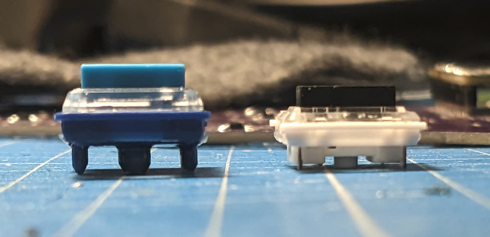
The normal Chocs are already low profile (for mechanical switch proportions), but the Minis do a few things to save even more height:
- Key travel is reduced by 0.6mm
- Their plastic bits sticking through the PCB are shorter by 1.5mm
- They *stick the switch body itself through the PCB*

|        | Total | Travel | Through-PCB Bits |
|--------|-------|--------|-----|
| Choc   | 12mm | 3mm    | 3.3mm |
| Mini   | 8.2mm | 2.4mm | 2.4mm |

Overall it's 3.8mm of difference. Which sounds small, but if your overall height is only 12mm, that's almost 32%!  
And *sticking the switch body itself through the PCB* is just kinda cool.  

# PCB Rejiggering
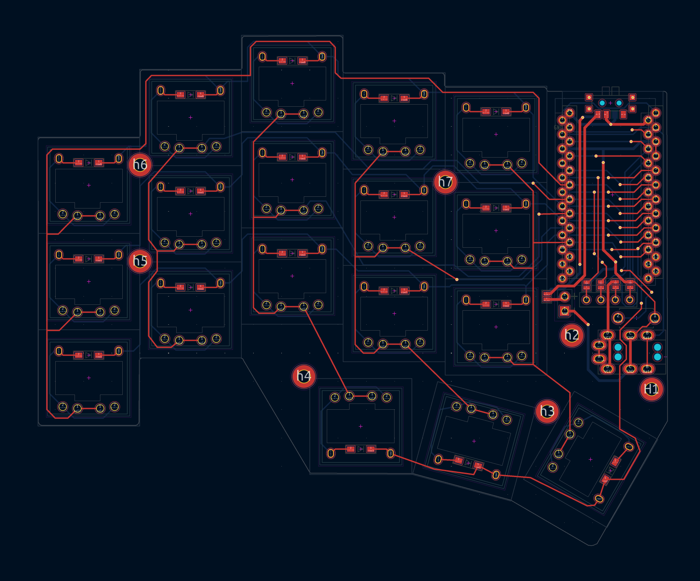
Since the Choc Minis have a big chunk of their main body sticking through the PCB, and their feet are placed differently, I had to redo a few things on the PCB.  

There were footprints for Choc Minis some library, but no reversible one. But mirroring the through-holes and wiring them up was easy enough. 
But then, thanks to the different pin placement and the giant holes necessary for the switch body, all of the switch matrix had to be rerouted.  
Not hard, just took time. A surprisingly relaxing game of connect the dots, actually. 

## Diodes, ugh
Since the goal was to be low-profile, through-hole diodes, as it turns out, are a no-go.  
With the diode placement as-is on the Chocofi, there were a few problems:
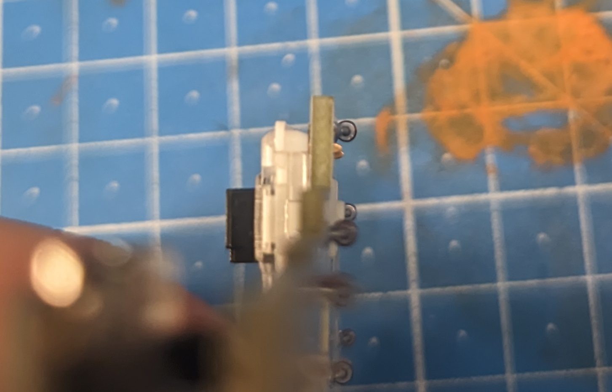
On the bottom, the diode body sticks out a good bit further than the switch body and feet → NG  

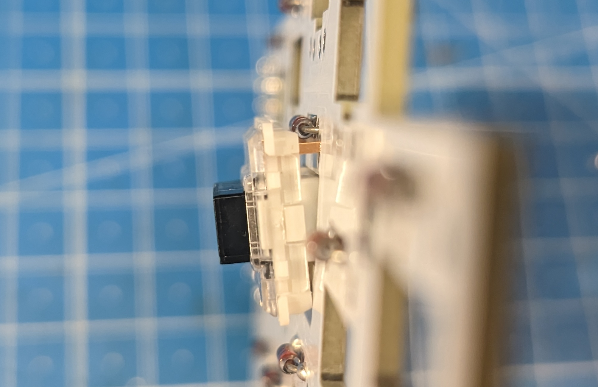
And on top, it obviously collides with the switch itself → also NG  

There was the option of using smaller SMD diodes on the bottom, but I didn't like the idea of those scraping against things and possibly getting knocked off.  
So I revised the PCB layout a bit, and put the diodes in the switch's LED hole.  
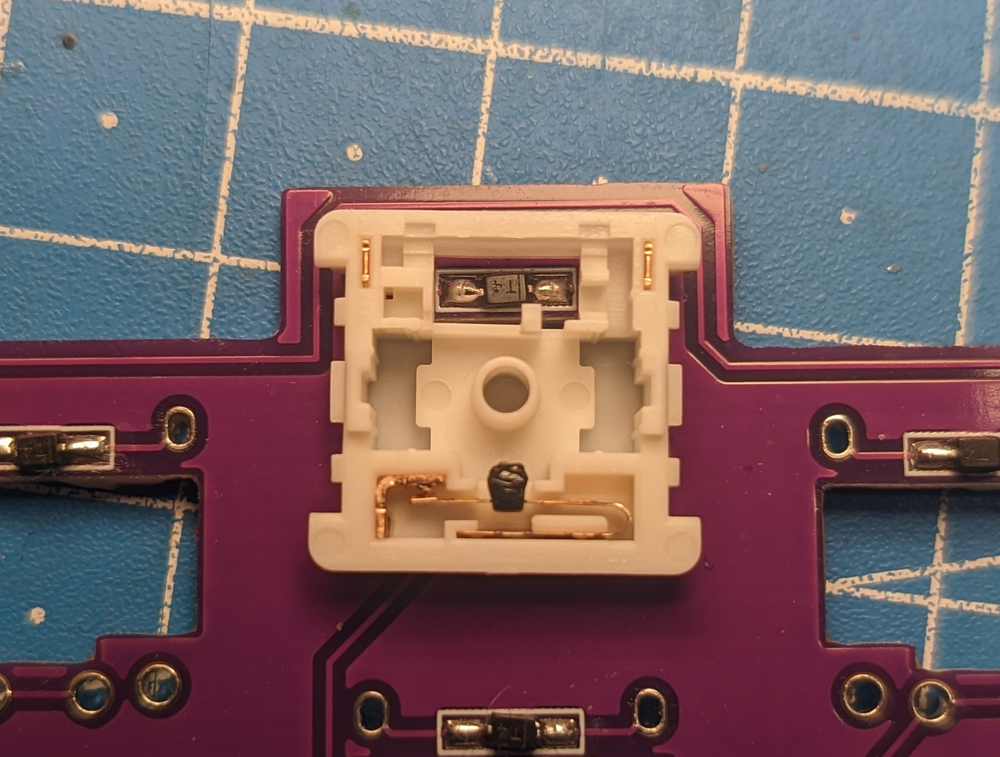
The holes for through-hole diodes had to go, too. And to still have to top and bottom layers connected, I used the two extra feet of the switches, that are otherwise unconnected. Could've just put in vias, but doing it this way made me feel very smart. 

# Spring Swap
I personally like my low profile switches as low force as possible, but the Choc Mini are only available in ~50g linear and tactile variants.[^clicky]  
I couldn't figure out what springs I would need to buy, or where to buy them, so I took a gamble and bought normal Choc blue switches in the hope they would fit and work.  

[^clicky]: Apparently there are/were also clicky ones(?), but I haven't seen those for sale anywhere.

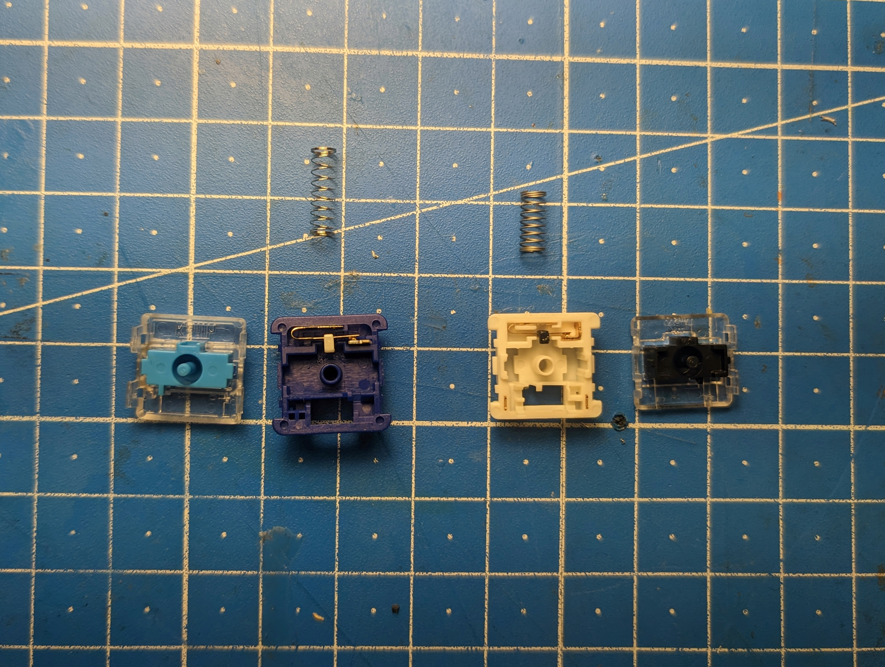

The normal Choc springs *are* quite a bit longer than the Choc Mini ones, but they do fit, and don't fully compress before the switch bottoms out.  But *just barely*.  
This does mean, that the switch ends up feeling heavier than the normal Choc blue/pink low force switches, but not by much and they're still *a lot* lighter than the stock Choc Mini 50g springs.  

The actual swapping of the springs wasn't hard, just time consuming. 
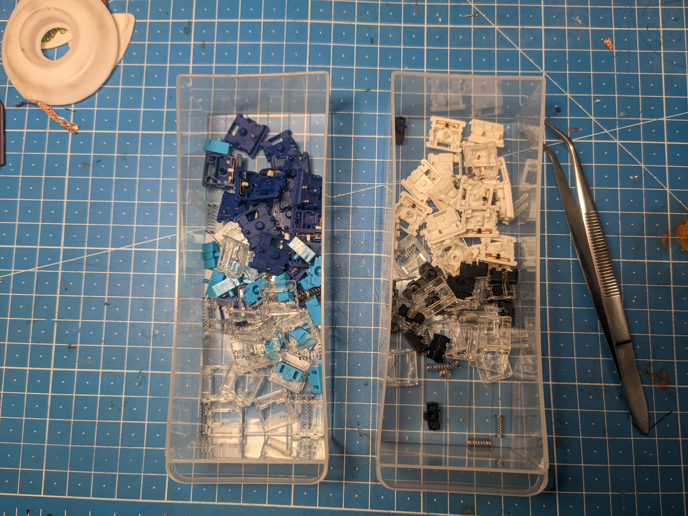
Took all of them apart, and then put them back together while using the *wrong* springs.  
And 2h later I had low-force Choc Minis!

# Result
Putting all the parts together wasn't anything special, just your normal keyboard soldering session.  
But was it worth it? Well ...

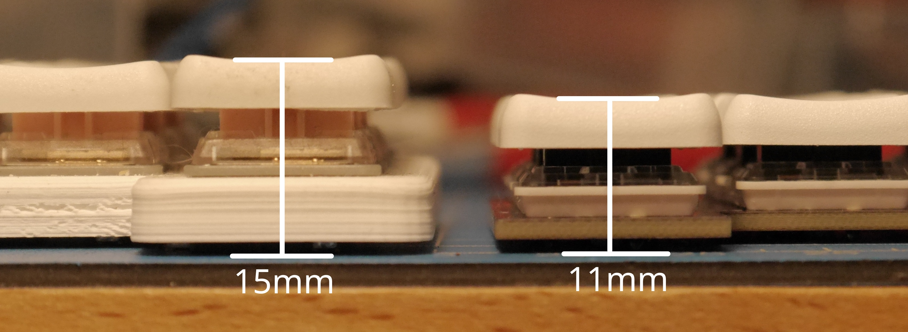
(Chocofi at 15mm on the left, Minifi at 11mm on the right)

It *is* shorter than my Chocofi. By 4mm.  
So about 27%.  
More than 1/4 shorter overall. Not bad!  

I don't think anyone would ever notice the difference just looking at it from the top.  
It's not built into anything that requires as-low-as-possible action either.  
But *I know* because *I made it*. And that's reason enough to merit its existence, I think. It's a hobby, innit.

# Non-Slip Life Hack
I always found it hard finding good/cheap rubber feet for keyboards like this.  
But it turns out you can just take a cheap mouse pad, stick double-sided sticky tape on it, and easily make very slip-resistant, thin, perfectly shaped rubber feet for basically free. 

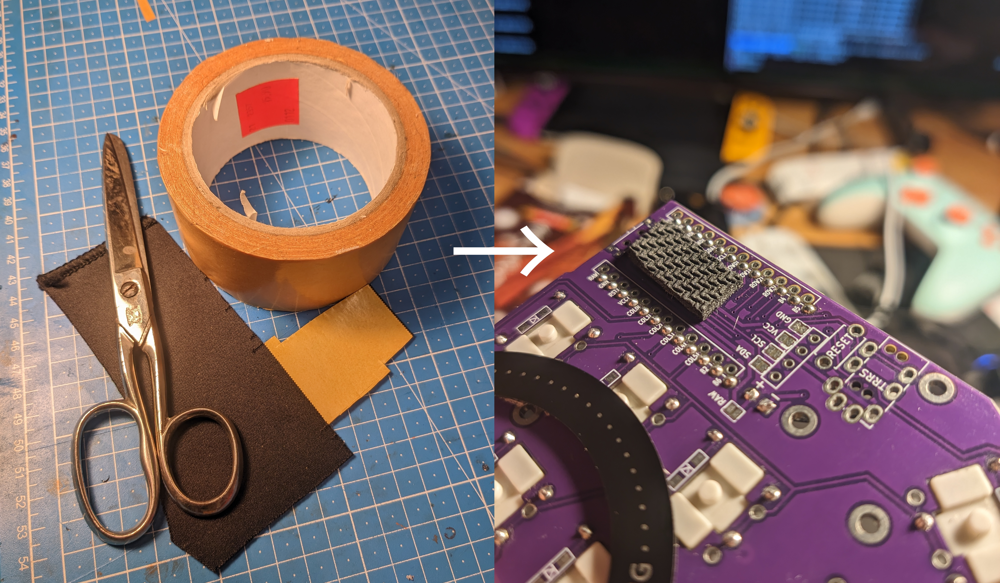

# Side Quest: MagSafe Mount

While fiddling with this, I also saw a few people using MagSafe paraphernalia for mounting their keyboards in all kinds of ways. From simple tenting to [hovering their keyboard the middle of a room lol](https://www.youtube.com/watch?v=Synej-kIGOs).  
And it makes a lot of sense too. MagSafe being magnet-based means it's easy to attach/detach, the ferromagnetic rings are super easy to just stick to something, and being the iPhone-integrated thing it is, it's super ubiquitous and cheap.  

So I had a go at it too. 

I got myself some basic, cheap MagSafe-tripod adapters and camera mounting clamp thingies (see [BoM](#magsafe-bom)).  
Nothing too special. But making the metal ring not add height to the keyboard was a bit tricky.  

My mouse pad-based rubber feet are ~2mm thick, the switches poke out about 0.8mm, and the ring also just below 1mm.  
And the rubber feet need to protrude a bit to still offer some grip. Not a lot of wiggle room.  

The sticky tape on the ring was not going to stick well to just the small bits of switch sticking out, and I didn't want to use big globs of glue or something like that either.  

So I made an overly specific shim, by modeling a flat ring and punching the same holes into it as the PCB:
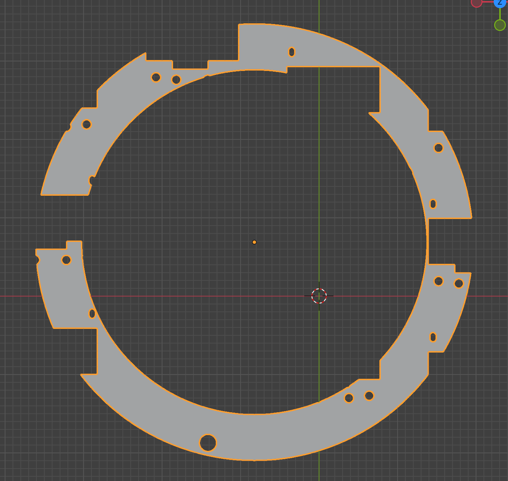
Easy to do in Blender, by exporting an STL from KiCAD, importing that and just `boolean modifier`ing it to the ring.  

Printed it, and got a perfectly fitting shim. 
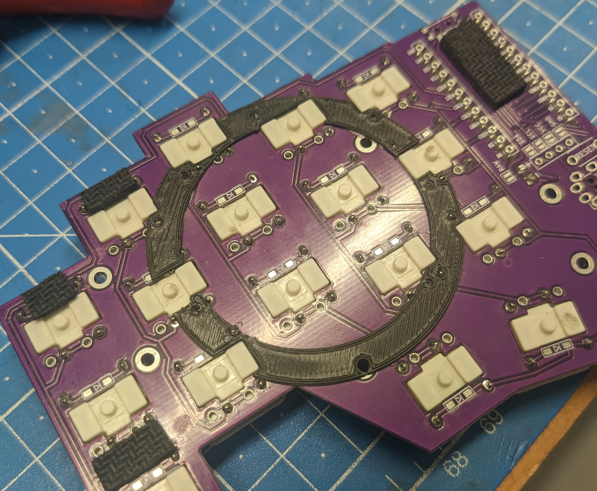
Very satisfying.  

This was at ~0.8mm thickness, so it filled in to just exactly the height all the switch bits were.  

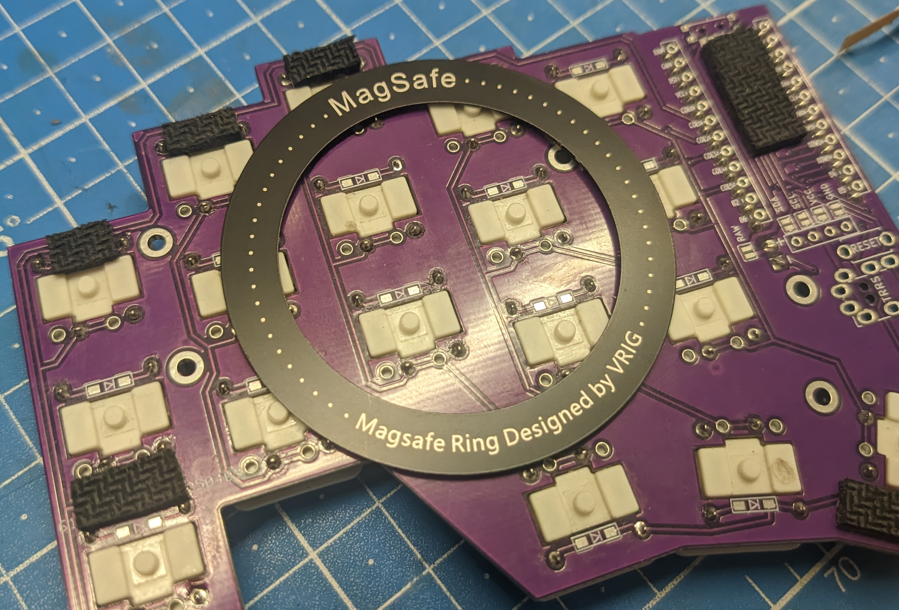

Then just stuck the ring on. 

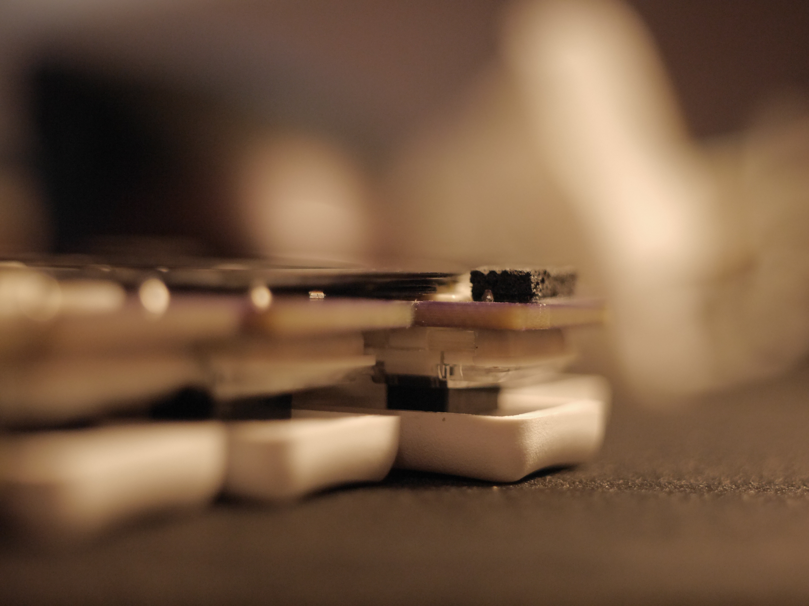

Got away with it with a few hairs worth of clearance.

... And it all works!  
The rubber feet anti-slippage is unhindered, the height not increased, *and* I can now do this:

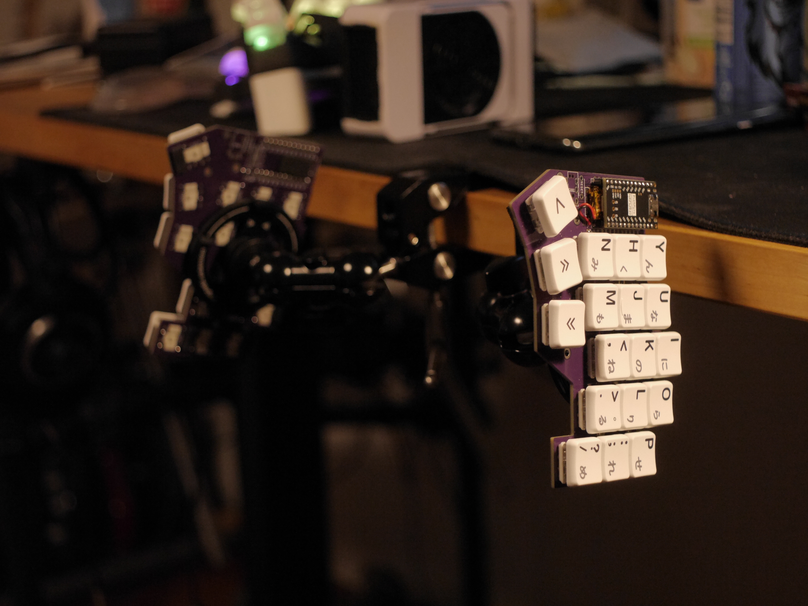
Mmh, ergonomics.

# BoM
- 36x [Kailh Choc Mini (PG1232)](https://chosfox.com/products/kailh-choc-mini-pg1232): ~25€
- 2x [NRF52840-based ProMicro-compatible MCU](https://www.aliexpress.com/item/1005006271779544.html)[^nnnockoff] : ~15€
- 5x[^minorder] PCB printed by [JLCPCB](https://jlcpcb.com/): ~10€
- 2x 3.7V 110mAh LiPo batteries (301230 or similar): ~5€
- 36x small SMD diodes (1N4148W SOD323 or similar): like 1€ tops?
- 2x [SMD on/off switches](https://ja.aliexpress.com/item/4000685483225.html): half a cent?

## MagSafe BoM:
- 2x [MagSafe<->tripod adapter + magnetic ring](https://www.amazon.de/dp/B0DM1ZXWT8): ~30€
- 2x [Whatever mounting clamp with tripod screw](https://www.amazon.de/dp/B00SIRAYX0): ~30€
- 3D printer for the PCB-MagSafe shim

[^minorder]: only need 2 but JLCPCB has a minimum order of 5
[^nnnockoff]: a.k.a. [nice!nano](https://nicekeyboards.com/nice-nano/) knockoffs

# Source
KiCAD project and gerber files are available in the [Minifi Git Repo](https://github.com/Rouji/minifi)
