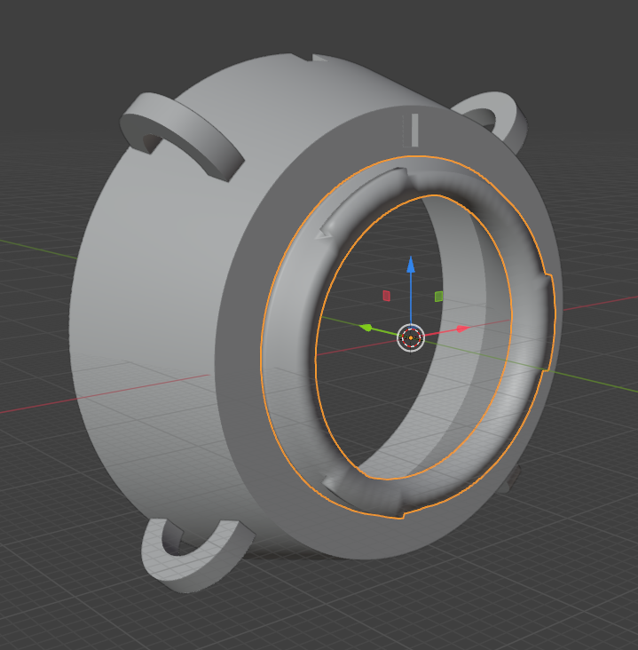

We had a supposedly dead [Sony VPL-FH36](https://pro.sony/en_GB/products/laser-projectors/vpl-fh36) at `$dayjob`.  
After performing an autopsy and being sure that it [was now indeed dead](disembowelment.jpg), I was left with a big old lens, that looked like it would also fit on a camera.  

Modeling an adapter wasn't super hard. It's mostly a tapered cylinder with an [MFT](https://en.wikipedia.org/wiki/Micro_Four_Thirds_system) mount bit on one end, a few holes cut out for sticky outy bits of the lens, and ... lugs.  

I completely eyeballed the length of the adapter (focal length?) from looking at how far away the LCDs in the projector were, and a few iterations of millimetre-guessing and re-printing.  
Science. 

Painting the inside matte black [kills internal reflections]().  

As are the lugs.  
I was too lazy to figure out a good mounting system, so: lugs.

It hasn't spontaneously disassembled itself yet, which is honestly more than I could ever ask for.  

And, it even takes pictures!

All very soft and dreamy.  
I don't know why that is.  
I don't hate it.  

With an extension tube or two, it does macro pretty alright, too.  

