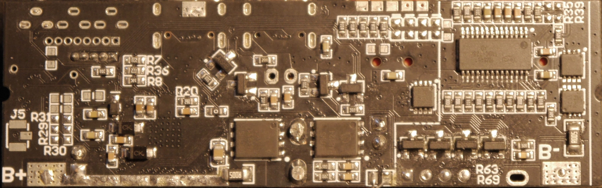
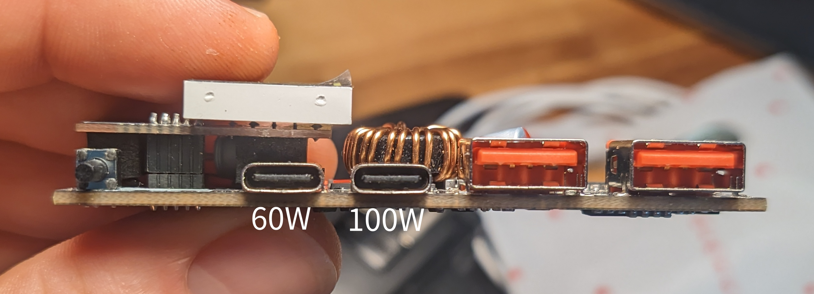
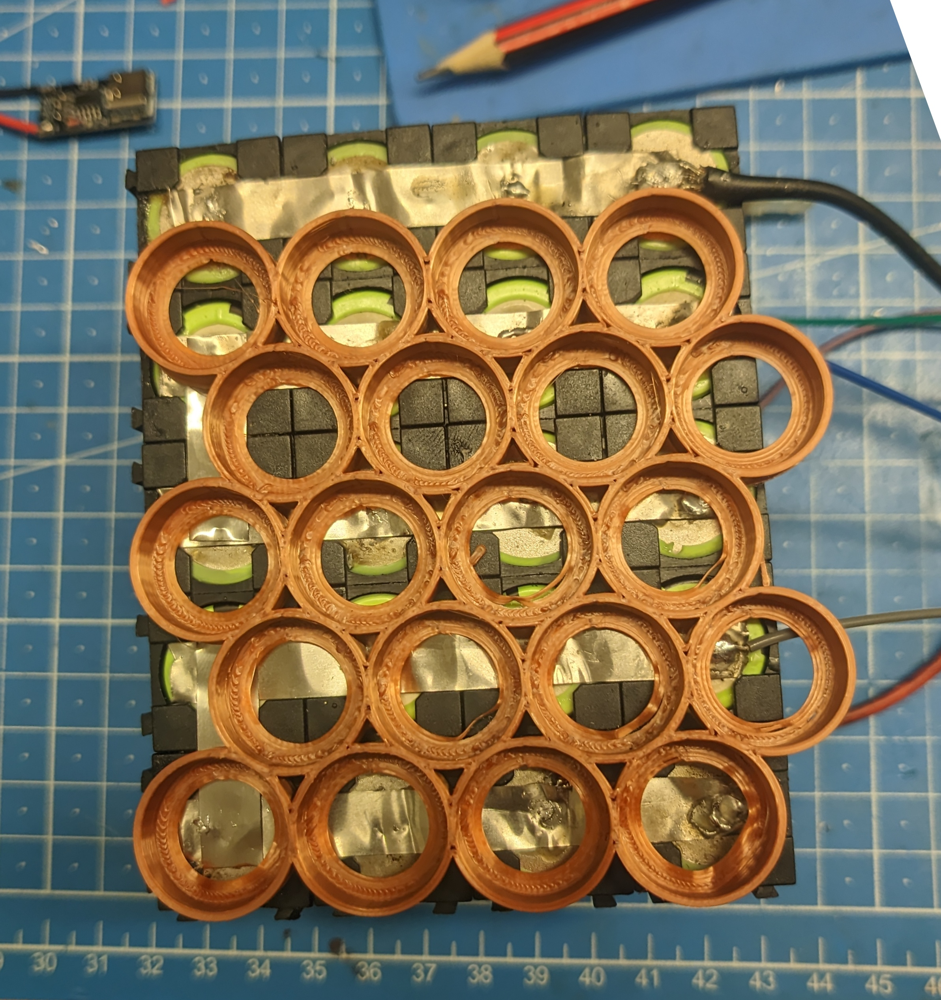
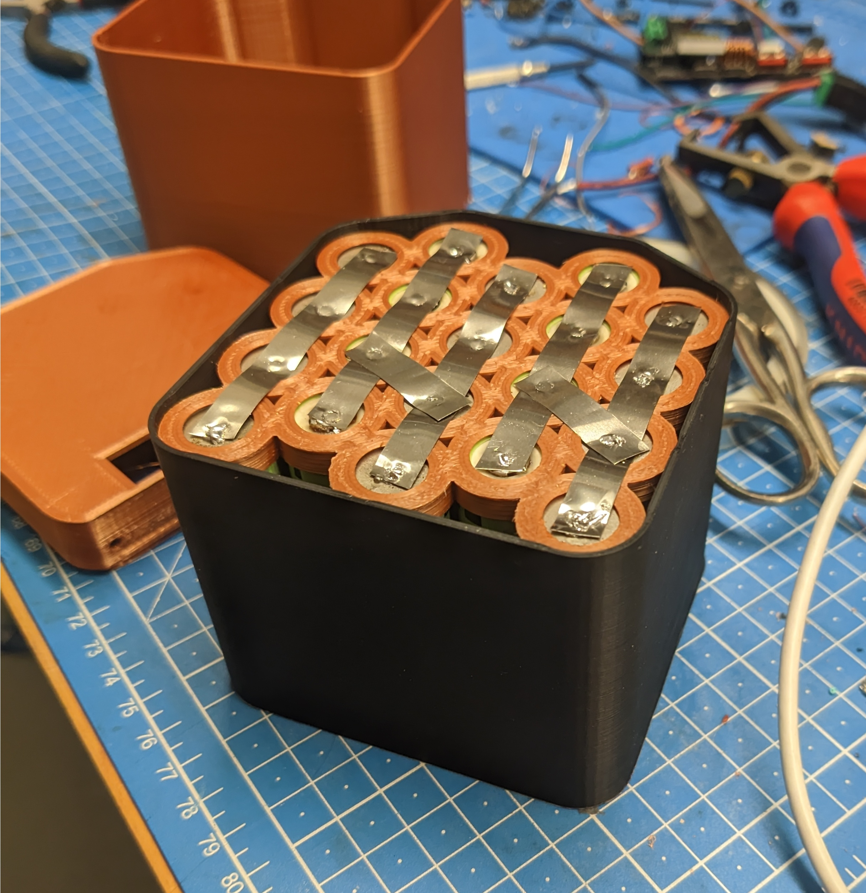
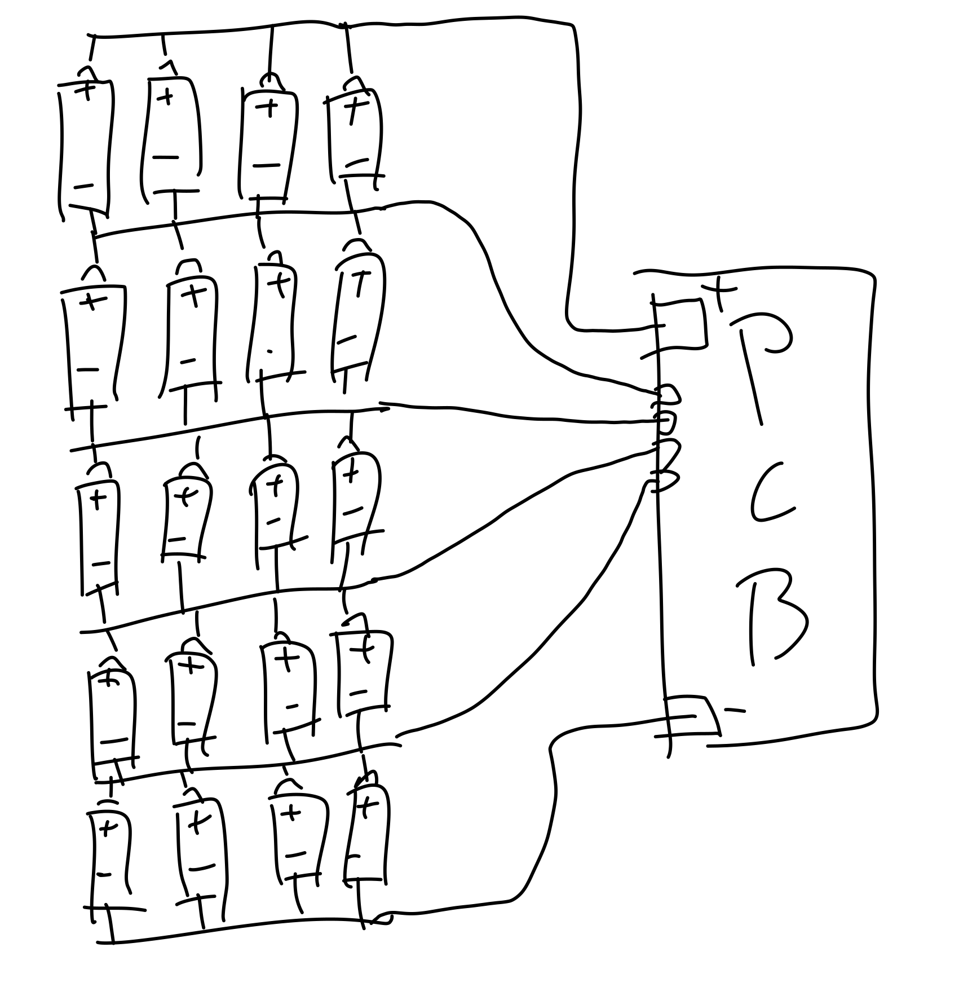
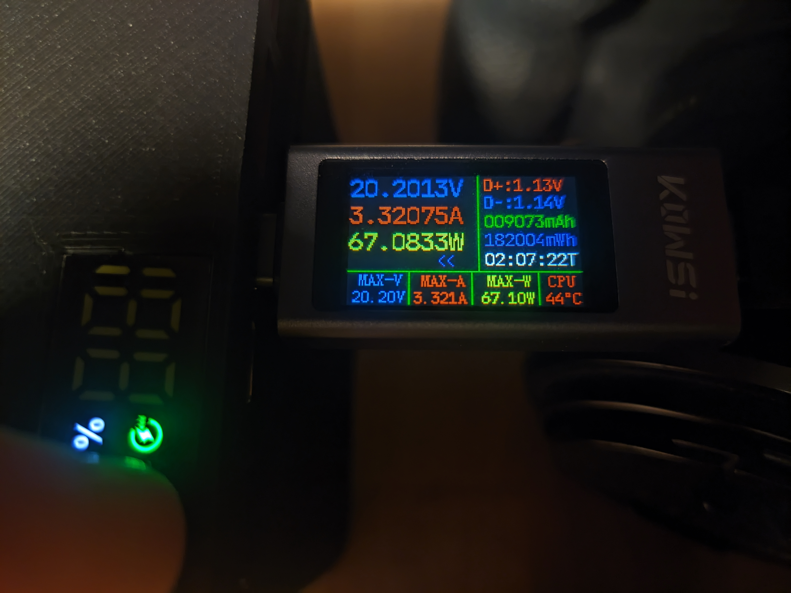

Ich hab mir eine ~200Wh, 100W USB-C PD Powerbank aus 18650er Zellen, die ich rumliegen hatte, und einem billigen PCB von AliExpress, gebaut.

BOM:
- [USB-C PD Platine](https://de.aliexpress.com/item/1005007227510089.html): 15€
- 20x 18650 Zellen: 50€-ish[^cell-price]
- Nickel Streifen: ~1€

Auch hilfreich:
- 3D Drucker und Filament (PLA is OK)
- Lötkolben
- Heißklebepistole
- Feuerlöscher
- gute Versicherung

# Das Leiterbahnenbrett

Gibt's auf AliExpress und Ebay und wahrscheinlich anderen Chinesium-Anbietern.
Die Listings kommen und gehen, aber eine Suche nach "usb-pd 100W power bank pcb" oder so sollte hinhauen.
Es gibt ein paar Versionen davon, für verschiedene Batterie-Konfigurationen.[^allthesame]

Ich hab mir die 5S Version geholt, weil 5 18650er in **S**erie ziemlich nah an die 20V rankommen, die 100W USB-PD braucht.
Und weniger Spannungsunterschied bedeutet effizientere DC-DC-Wandlung. Glaub ich zumindest.

Doku ist eher spärlich. 
Mitgeliefert kommt gar nichts, und je nach Listing gibt's ein paar unvollständige JPEGs mit Tabellen und maschinell übersetztem Englisch, oder gar keine.  

Es gibt ein paar Sachen, die man mit Widerständen/Jumpern einstellen kann, die aber für diesen Build zum Glück großteils irrelevant sind. 

[^allthesame]: Ich *glaube*, dass alle PCB Versionen gleich sind, nur mit verschiedenen Widerständen vorinstalliert. Könnte mich aber irren.

## Kapazität Setting

Mit dem Widerstand **R8** kann man die Kapazität einer (wenn ich das richtig verstanden habe) Zellen*reihe* einstellen. In dem Fall von 4 18650ern in in Summe. 

Doku JPEG sagt:

> | R8 | Cell Capacity |
> |----|---------------|
> | 6.2KΩ  | 5000mAh  |
> | 12.4KΩ | 10000mAh |
> | 18.7KΩ | 15000mAh |
> | 24.9KΩ | 20000mAh |
> | 30.9KΩ | 25000mAh |
>
> Calculation formula: Ω = mAh ÷ 0.8  
> Example: 8000 ÷ 0.8 = 10000 -> 8000mAh = 10KΩ

Der eingebaute Widerstand hat `10C` draufstehen, was 12.4KΩ heißt. 
Für meine ~2800mAh Zellen sollte es `(4 × 2800) ÷ 0.8 = 11200 ÷ 0.8 = 14000Ω` sein, aber ich glaub 12.4KΩ ist nah genug dran. Und ich hab eh keine SMD Widerstände.  
Das beeinflusst angeblich eh nur die Prozentanzeige auf dem Display, also kann man's im Zweifelsfall vermutlich auch komplett ignorieren.

Man wird auch gewarnt, nichts über 30.9KΩ reinzutun. Ich vermute aber gößere Kapazitäten gehen auch, und es mag nur keine großen Widerstandswerte. 

Außerdem: 
> The maximum charging time is 50 hours, so don't be too big!

Letzteres gute Lebensweisheit, denk ich.  
Ersteres hab ich nicht getestet. Diese Powerbank braucht nicht mal annähernd so lang zum Laden. 

## Leistung Setting

**R20** gibt die maximale Ausgangsleistung an.
Wenn man sich die 100W Version holt, sollte das schon auf 100W eingestellt sein.


> | R20 | Power |
> |-----|-------|
> | 27KΩ | 65W  |
> | 18KΩ | 60W   |
> | 13KΩ | 45W   |
> | 9.1KΩ | 30W   |
> | 6.2KΩ | 27W   |
> | 3.6KΩ | 100W   |


## Batteriespannung Setting

**R7** stellt den "Batterie Typ" ein.  
Eingebaut sind 27KΩ, was 4.2V entspricht und schon richtig für diese Zellen ist. 


> | R7 | Battery Type |
> |----|--------------|
> | 27KΩ | 4.2V       |
> | 18KΩ | 4.3V       |
> | 13KΩ | 4.35V      |
> | 9.1KΩ | 4.4V      |
> | 6.2KΩ | 4.15V      |
> | 3.6KΩ | 3.65V lithium ion phosphate |


## Ports Sind Nicht Gleichberechtigt

Nirgendwo erwähnt ist, dass nur der rechte USB-C Port tatsächlich 100W (laden *und* entladen) kann.  
Der linke ist auf 60W begrenzt, warum auch immer. Vielleicht unterstützt der andere Ladeprotokolle oder so?

Hab da alle möglichen Kombis von Ladegerät/Kabel/Verbraucher ausprobiert, bis ich das rausgefunden hab ...

## BMS?

Soweit ich das beurteilen kann, macht das PCB kein Balancing. Die JPEGs deuten darauf hin, und es sind auch keine Komponenten drauf, die danach aussehen.  
Die extra Verbindungen für zwischen den seriellen Zellen sind also nur für Unter-/Überladungsschutz.  
Scheint so als wäre es eine Option ein echtes BMS zwischen PCB und Zellen zu schalten, und das wäre vielleicht auch eine ganz gute Idee. 
Hab bis jetzt keins gefunden, das mir gefällt, aber wenn ich eins finde tu ich das.

# Die Bauung

Ziemlich simples, quadratisch-iges 5S4P Pack unten drin.  
Ziemlich fummeliges, basteliges PCB Gehäuse oben drauf.  

## Untere Hälfte

Ursprünglich hatte ich diese Lego-artigen zusammensteckbaren 18650 Halter, aber war nicht ganz zufrieden damit. Nehmen unnötig viel Platz weg, haben abstehende Stücke an 2 Kanten, um die ich herumdesignen müsste, ...  
Dann hab ich ein [Openscad Skript für 18650 Halter](18650_holder.scad)[^scadsource] gefunden, das auch so Bienenwaben Layout kann, und fand das viel besser.
Weniger Platzverschwendung, interessantere Form, einfacher zum ein-designen, weil ich's selber drucke.  

Ok, *so* viel Platz spart's auch wieder nicht. Aber trotzdem cool. 

Nachdem ich das alte Pack zerlegt und mit dem Bienen-Design neu zusammengebaut hatte (+ Gehäuse Testfit):

**Anmerkung**: Ja, ich hab die Streifen an die Zellen angelötet. Ja, das ist "gefährlich" und man sollte immer nur Punktschweißen. Ich hab halt kein Gerät dafür. Bitte vergib mir.

## Obere Hälfte

Das PCB hat natürlich überhaupt keine Maße oder irgendwas dokumentiert. 
War viel Augenmaß und Zungenanwinkelung involviert. 

Die Ports richtig hinbekommen hat Spaß gemacht.[^fun]  
Außerdem sehr fummelig, die Ports vorne, und gleichzeitig das Display oben durchzufädeln.

Hatte keine gute Idee, wie ich das PCB befestigen könnte (keine Löcher oder so, also hab ich's einfach so zwischen 2 Wänden eingeklemmt. 

... was auch funktioniert, aber nicht reicht, wenn wer einen USB Stecker mit bisschen Wucht falschrum reinsteckt. 

Der Hohlraum ist auch grade groß genug, um den ganzen Kabelsalat zwischen PCB und Zellen reinzustopfen. Besonders mit Steckern dazwischen. Die nehmen viel Platz weg.

[^fun]: Nicht.

# Verkabelung

Ziemlich straightforward.  
Hier eine professionelle CAD Zeichnung:

Ist eine ganz gute Idee, für alle PCB<->Batterie Verbindungen Stecker zu verwenden. 
Die anlöten, während sie unter Strom stehen, ist sehr gut, wenn man Kurze reißen will. 
Nicht, dass ich das probiert hätte, oder so. 

Hatte keine passenden 4-Pin Stecker für die Messverbindungen, also haben so Breadboardkabel hergehalten.  
Außerdem noch Isolierung drüber. Genau genommen wahrscheinlich unnötig, aber kann nicht schaden.  
(Man merke außerdem: Heißkleber 😅)

# Aus 2 Mach (Mit Kleber) 1

Hab irgendwie nirgendwo gut Schrauben oder so unterbringen können.  
Also hab ich's einfach geheißklebert lol. 

Oberseite hat eine Lippe, die sich gut in die Unterseite einpasst, und gleichzeitig eine gute Klebefläche ist.  

Notfalls kann man das Ganze trotzdem noch graaade genug aufwärmen, dass nur der Heißkleber weich wird, und die Hälften auseinanderziehen, ohne irgendwas kaputt zu machen. 

# (Nicht Ganz) Unbegrenzte Macht!!

Die einzelnen Zellen waren neu (glaub ich) 2800mAh.  
Das heißt im besten Fall hätte ich `20 × 2.8Ah × 3.7V = 207.2Wh`.  

In Wirklichkeit:

Frisst so um die 210Wh, wenn's mit 20V 100W lädt.

Und spuckt so um die 180Wh aus, wenn's mit 20V 100W entlädt. 

Nur 12% weniger als die 207.2Wh. Nicht schlecht!

Hab's nicht ausprobiert, aber ich schätze mal, die Ports und Modi, die weniger als 20V ausspucken, sind ein bisschen weniger effizient.  

Nennenswert: Es schafft die 100W nicht bis 0% runter. 
Bei so 30~20% fängt's an sich spontan abzuschalten und schafft dann stabil nur mehr so ~70W. 

# Fertig!

Das war's!  
Hier der Peel:



# Her Mit den Dateien

Und hier findest du raus, dass ich das schäbig in Blender zusammengeworfen hab, weil mir FreeCAD noch immer in der Birne wehtut.  
Sorry.  

[OpenSCAD 18650 holder script](18650_holder.scad)[^scadsource]  
[Exported 18650 holder STL](18650_holder.stl)  
[Case Blender file](powerbank.blend)  
[Case Bottom STL](bottom.stl)  
[Case Top STL](top.stl)

Teile davon eventuell zwischen 100%~105% skaliert drucken, damit alles ineinander passt. Toleranzen und so. 

[^scadsource]: Komm einfach nicht mehr drauf, wo das Original her ist. Tut sehr leid :(

[^cell-price]: Grober Preis derzeit. Hab meine vor paar Jahren für was anderes gekauft.
