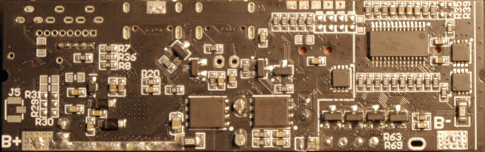
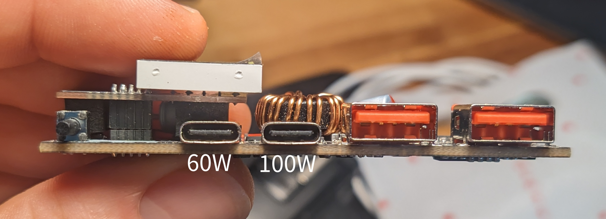
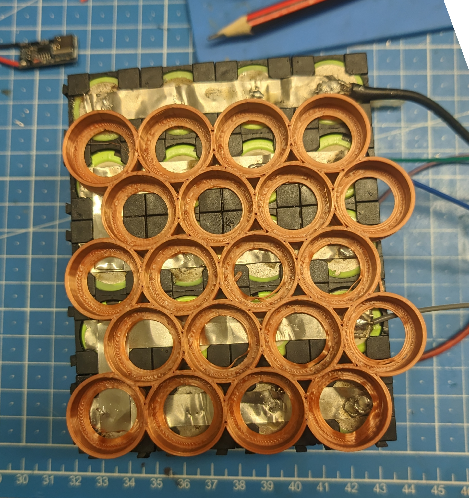
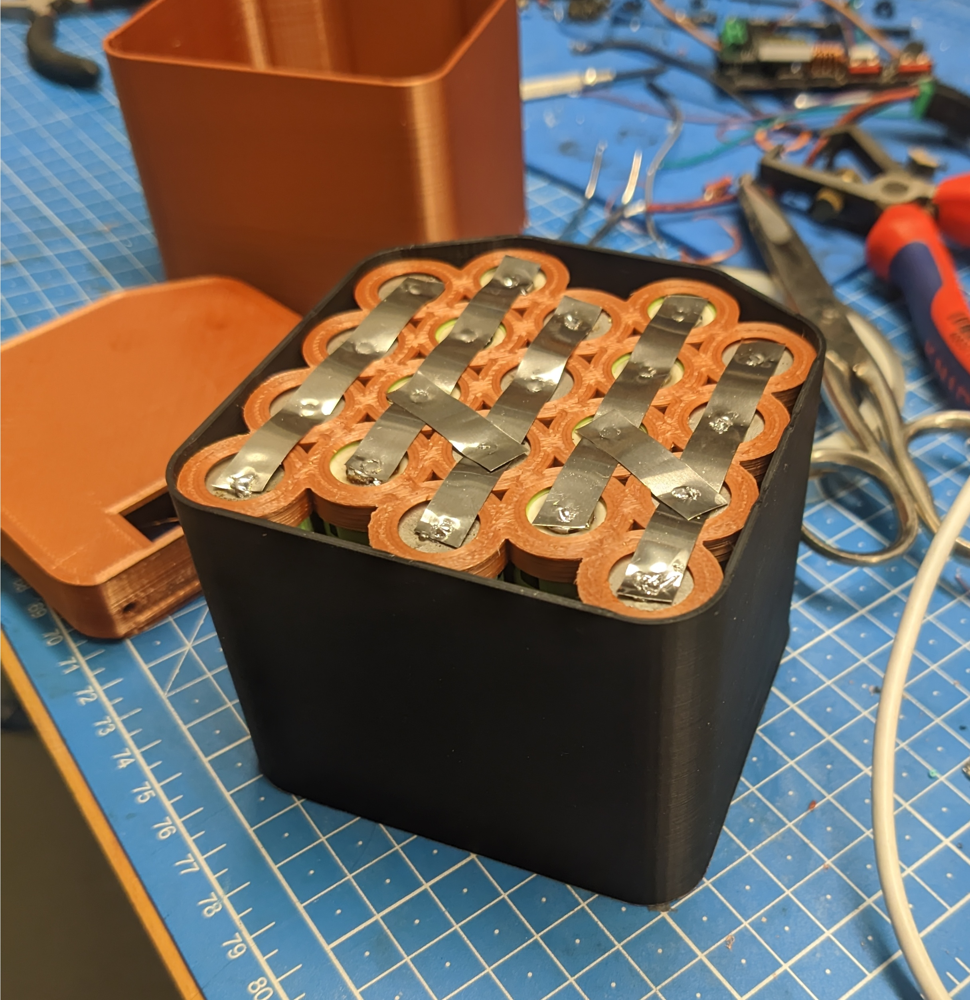
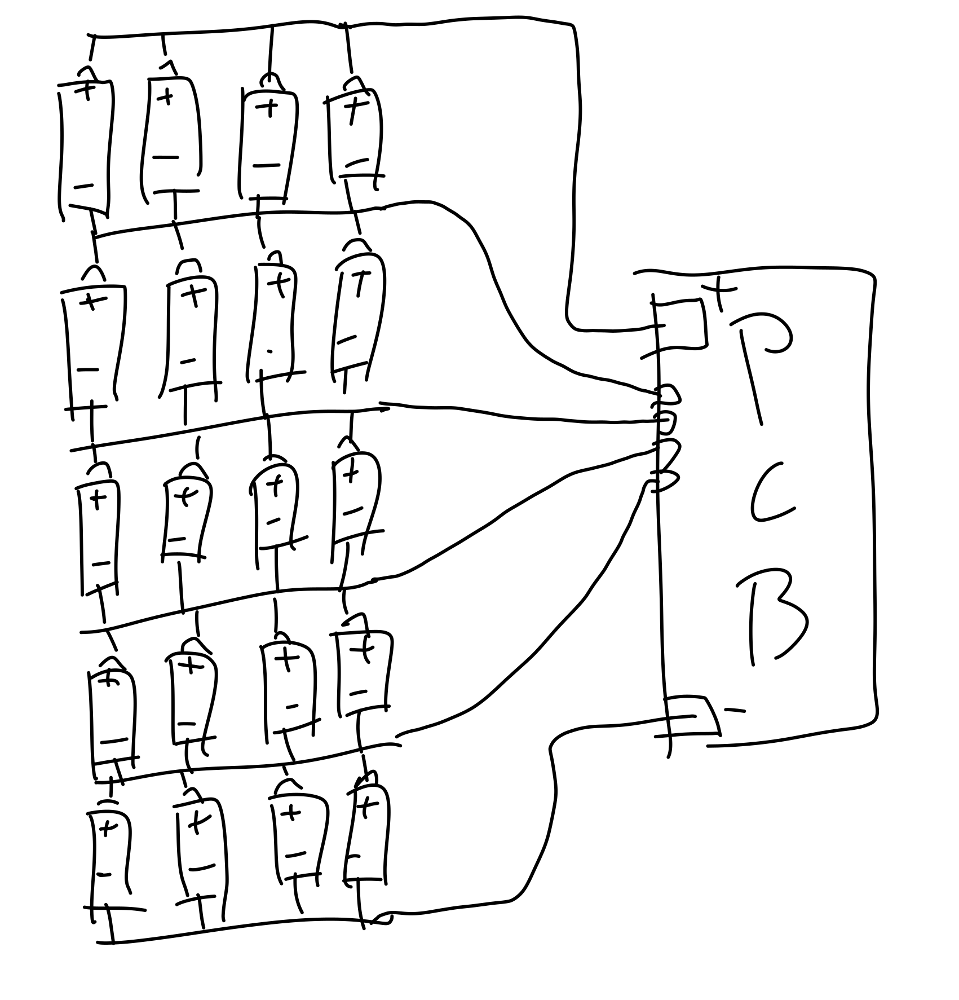
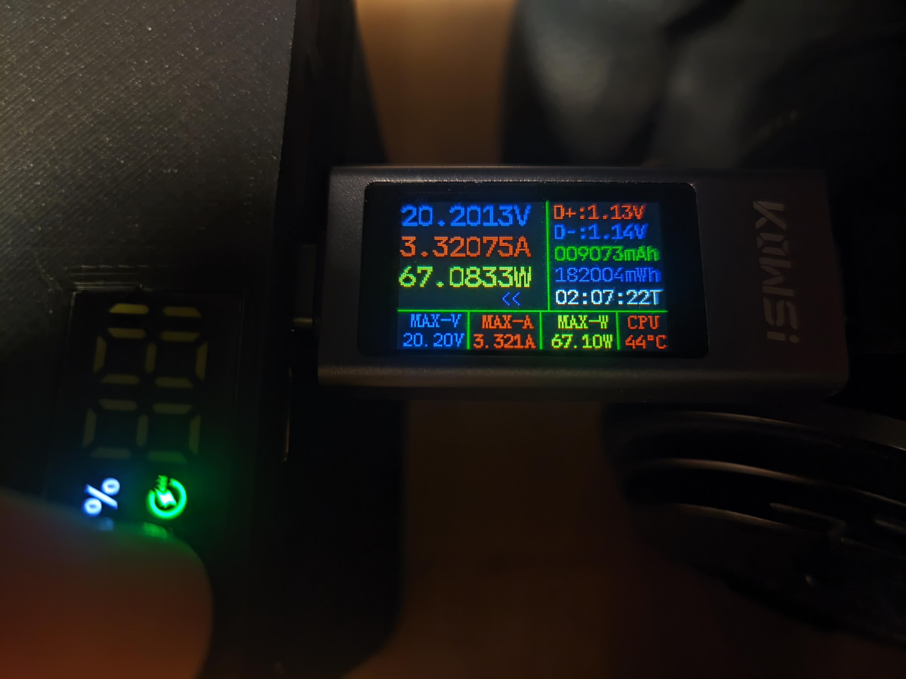

I built a ~200Wh, 100W USB-C PD power bank from 18650 cells I had lying around, and a cheap PCB from AliExpress.

BOM:
- [USB-C PD board](https://de.aliexpress.com/item/1005007227510089.html): 15€
- 20x 18650 cells: 50€-ish[^cell-price]
- Nickel strip: ~1€

Also needed:
- 3D printer and some filament (PLA is fine)
- soldering iron
- hot glue gun
- fire extinguisher
- good insurance

# The PCB

Available on AliExpress and eBay and probably other chinesium outlets. 
Listings come and go, but searches for "usb-pd 100W power bank pcb" or some such should do the trick. 
There are a few versions for different battery pack configurations.[^allthesame]  

I got the 5S one, since 5 18650s in **s**eries gets you pretty close to the 20V, that 100W USB-PD requires. 
And less voltage difference means more efficient DC-DC conversion. I think.  

Documentation is kind of sparse on these. 
You don't get any in your package, and depending on the online listing there might be a few incomplete JPEGs with tables and machine translated English in them, or none at all.  

There are a few things configurable via resistors/jumpers, which are fortunately all mostly irrelevant for this build. 

[^allthesame]: I *think* they're all the same PCB, just with different resistors pre-installed. Don't quote me on that though.

## Capacity Setting

Resistor **R8** sets the capacity of (if I understand correctly) one string of cells. (i.e. the overall capacity of 4 18650s in parallel in this case).  

The documentation JPEGs say:

> | R8 | Cell Capacity |
> |----|---------------|
> | 6.2KΩ  | 5000mAh  |
> | 12.4KΩ | 10000mAh |
> | 18.7KΩ | 15000mAh |
> | 24.9KΩ | 20000mAh |
> | 30.9KΩ | 25000mAh |
>
> Calculation formula: Ω = mAh ÷ 0.8  
> Example: 8000 ÷ 0.8 = 10000 -> 8000mAh = 10KΩ

The pre-installed one is marked `10C`, which is 12.4KΩ.  
For my ~2800mAh cells, it should be `(4 × 2800) ÷ 0.8 = 11200 ÷ 0.8 = 14000Ω`, but I think 12.4KΩ is close enough. And I don't have any SMD resistors anyway.  
This allegedly only affects the percentage readout on the LCD, so you can probably also just ignore it regardless.  

It warns you to not put anything above 30.9KΩ in there. I reckon bigger battery capacity would be fine and it just doesn't like bigger resistor values. 

Also this:
> The maximum charging time is 50 hours, so don't be too big!

The latter half being good general life advice, I think.  
I haven't tested the former. This power bank doesn't take anywhere near that long to charge. 

## Power Setting

**R20** sets the maximum charging and discharging power.  
This should be set to 100W already if you got the 100W version.


> | R20 | Power |
> |-----|-------|
> | 27KΩ | 65W  |
> | 18KΩ | 60W   |
> | 13KΩ | 45W   |
> | 9.1KΩ | 30W   |
> | 6.2KΩ | 27W   |
> | 3.6KΩ | 100W   |


## Battery Voltage Setting

**R7** sets the "battery type".  
Pre-installed is `27KΩ`, which is 4.2V and already correct for this build.


> | R7 | Battery Type |
> |----|--------------|
> | 27KΩ | 4.2V       |
> | 18KΩ | 4.3V       |
> | 13KΩ | 4.35V      |
> | 9.1KΩ | 4.4V      |
> | 6.2KΩ | 4.15V      |
> | 3.6KΩ | 3.65V lithium ion phosphate |


## Over/Under Temperature Protection

**R36** sets the temperature protection threshold.  
Again, probably don't need to touch this, but just in case you want to: 


> | R36 | min. charge temp | max. charge temp | min. discharge temp | max. discharge temp |
> |-----|-------------------|-------------------|----------------------|----------------------|
> | 27KΩ | 0°C | 45°C | -20°C | 60°C |
> | 18KΩ | 2°C | 43°C | -10°C | 55°C |
> | 13KΩ | 0°C | 45°C | -10°C | 55°C |
> | 9.1KΩ[^slowcharge1] | -10°C | 55°C | -20°C | 55°C |
> | 6.2KΩ[^slowcharge2] | 0°C | 45°C | -20°C | 60°C |
> | 3.6KΩ[^slowcharge3] | -10°C | 55°C | -20°C | 60°C |

[^slowcharge1]: this actually says: `-10°C <- 0.2°charge -> 0°C <- normal charge -> 45°C <- -0.1v*N -> 55°C` and I'm not sure what that means.
[^slowcharge2]: `2°C <- 0.1°C -> 17°C <- normal charge -> 43°C` even less sure about this one.
[^slowcharge3]: `-10°C <- 0.2°charge -> 0°C <- normal charge -> 45°C <- 0.2°charge -> 55°C` idk man.



## Ports Aren't Created Equal

Not mentioned anywhere is, that only the right USB-C port actually does 100W (charging *and* discharging).  
The other one is limited to 60W, for some reason. Maybe it supports a different set of charging protocols?  

I got very confused trying all kinds of charger/consumer/cable combinations on all the ports until I figured that out ...  

## BMS?

As far as I can tell, this board doesn't do any charge balancing. The JPEGs kind of say as much, and there doesn't seem to be any circuitry for it.  
So the connections going between the series connections are purely for protection.  
Putting a proper BMS between this PCB and the cells seems to be a supported configuration, and might be a good idea. 
I haven't found one I like yet, but will add one when I do.

# The Buildening

Pretty basic, square-ish 5S4P pack in the bottom.  
Pretty fiddly, bodgy PCB case in the top.  

## The Bottom

Originally, I had those Lego-like square interlocking 18650 holder things, but was unhappy how they wasted a lot of space, and had sticky-outy bits along 2 edges I'd need to cut off and/or design around.  
I found [an 18650 holder openscad script](18650_holder.scad)[^scadsource] online, that can do honeycomb layouts, and liked that much better. 
Less wasted space, more interesting shape, and easier to design around since it's a thing I printed myself.  

Ok it doesn't save *that* much space, but it's still cool. 

After undoing the old pack and redoing it with the honeycomb, I had this (+ case test fit):

**Note**: Yes I soldered the nickel strips onto the cells. I know that's "dangerous" and you should spot weld them instead. I don't have a spot welder. Please forgive me. 

## The Top

PCB came with no dimensions at all. Much eyeballing and tongue angleing was involved.

Getting the ports right was fun.[^fun]  
Also very fiddly, fitting in the ports through the front and the display through the top simultaneously. 

I couldn't figure out a good way to mount the PCB (no mounting holes or anything), so I went for a kind of friction fit. 

...which does work, but doesn't like USB cables being shoved in the wrong way round with force. Add glue.  

The empty space is also just enough to shove in the slack of all the wires between the PCB and the cells. Especially with connectors in-between, those take up a lot of space.

[^fun]: Not

# Wiring
Wiring is pretty straightforward.  
Here's a professional CAD drawing:  

Adding connectors for all the wires is a very good idea. 
Soldering the live connections is a good way of shorting things out. 
Ask me how I know. 

I didn't have any fitting 4-pin connector for the sensing connections, so I made do with these breadboardy jumper wire things.  
Also added insulation. Shouldn't technically be necessary, but can't hurt.  
(Also note the added hot snot 😅)

# Gluing the Halves Together

Couldn't come up with a good/easy way of adding screws or something.  
Literally just hot glued them together lol. 

The top has a bit of a lip, so it locates into the bottom pretty well. Also gives it a good surface for gluing.  

In a pinch you can still heat it up juuust enough for only the glue to soften and pull it apart without damage. 

# (Not Quite) Unlimited Power!!

These cells were (I think) 2800mAh when new.  
That means in a perfect world, I'd get `20 × 2.8Ah × 3.7V = 207.2Wh` out of this.  

In reality:

It eats about 210Wh when charging at 20V 100W.

And spits out about 180Wh when discharging at 20V 100W.  

Only 12% off the 207.2Wh. Not bad!

I haven't tested it, but I suspect the ports and modes that output less than 20V to be a bit less efficient.  

One thing to note: It doesn't actually manage 100W all the way down to 0%. 
At around 30~20% it starts cutting out if you try drawing a full 100W, and only stays stable below ~70W.

# Done!

That's it!  
Here's a peel. 



# Gimme The Files

This is the part where you find out I did this very badly in Blender because I still can't wrap my brain around FreeCAD.  
I'm sorry.  

[OpenSCAD 18650 holder script](18650_holder.scad)[^scadsource]  
[Exported 18650 holder STL](18650_holder.stl)  
[Case Blender file](powerbank.blend)  
[Case Bottom STL](bottom.stl)  
[Case Top STL](top.stl)

Might need to print some things at somewhere between 100%~105% to fit into each other properly. 

[^scadsource]: Can't for the life of me find the original source. Very sorry :(

[^cell-price]: Rough current price; I had mine left over from a project years ago.
